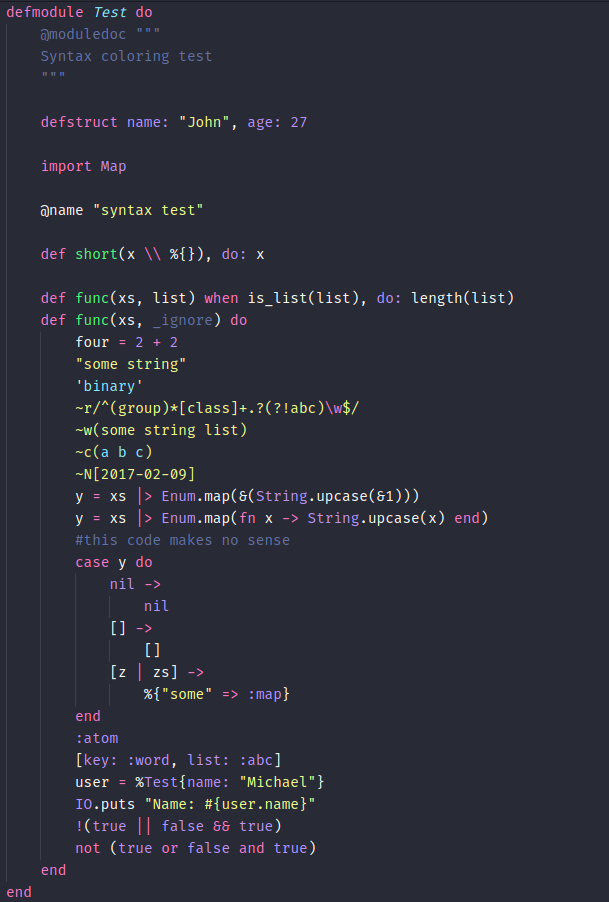
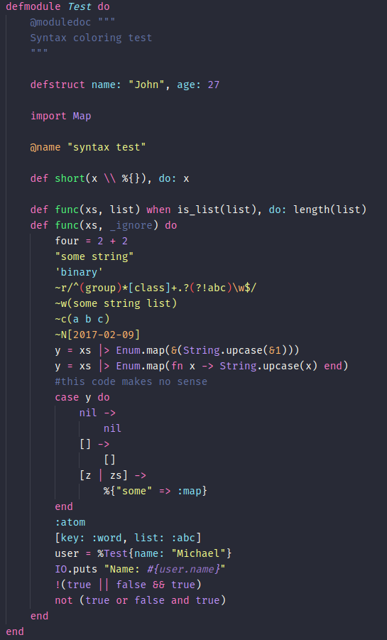
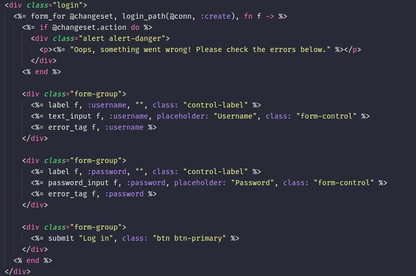
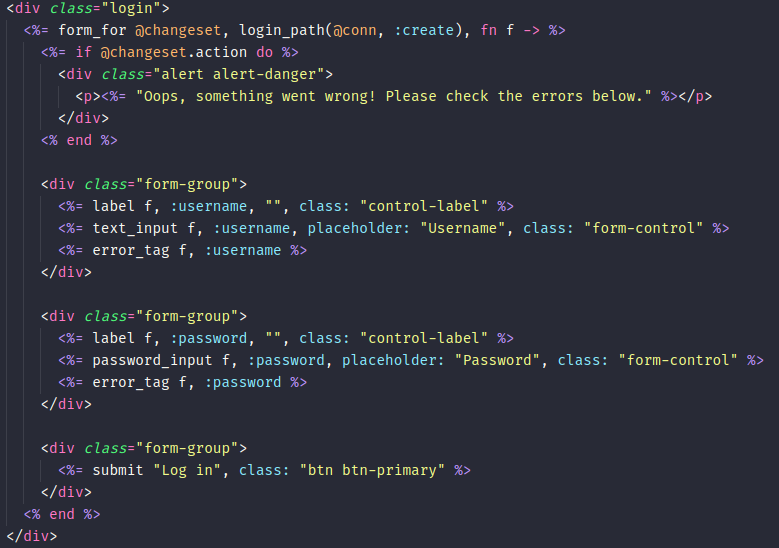

# Dracula (Elixir)

Elixir customized syntax based on a default Dracula and Dark+(Elixir)

**Note:** For non-elixir files, this syntax should look the same as Dracula

## Elixir files
Default Dracula             |  Dracula (Elixir)
:-------------------------:|:-------------------------:
 | 

## Templates files
Default Dracula             |  Dracula (Elixir)
:-------------------------:|:-------------------------:
 | 
